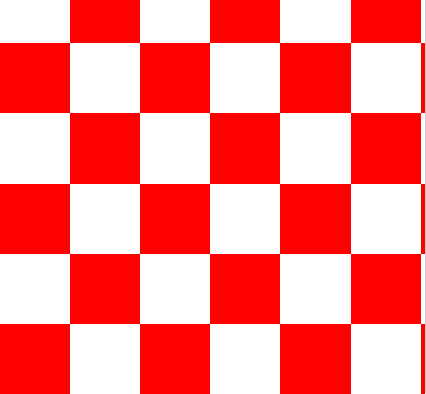
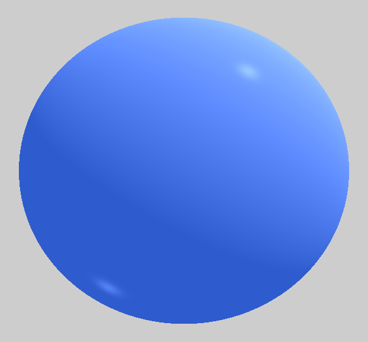
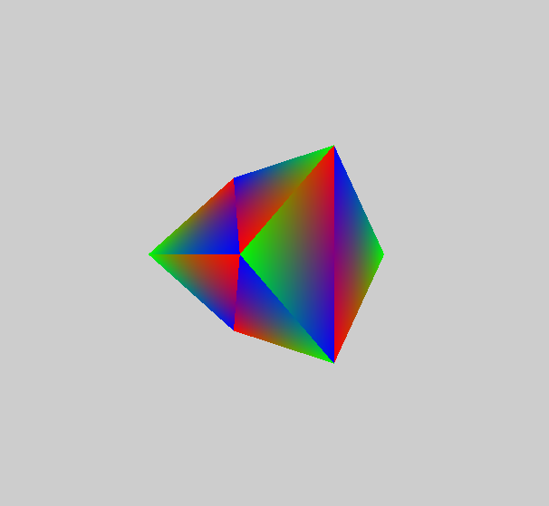
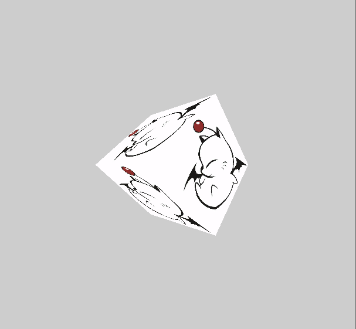
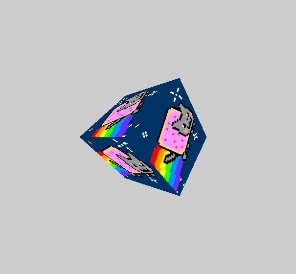

# naive-raytracer
This repo is for displaying my solo project using C# scripts to generate various graphics via raytracing on a Unity camera object.
Since this project was originally an assigment, there is some starter code in NaiveRayTracer.cs that was provided. However, the implementation of each raytracer was entirely completed by me.

## Process
The images are generated by attaching the "NaiveRayTracer.cs" script to a camera object in a Unity scene. An image file can additionally be attached to the camera object for use in the uvmapping raytracer.
In order to swap between different raytracers, the variable string renderMethod in NaiveRayTracer.cs should be altered to choose a different method.

## Output Samples

### Checkerboard

### Sphere
The sphere is generated using the Phong model (ambient, diffuse, and specular light).

### Cube (Barycentric Coordinates)

The cube is comprised of triangles that have been defined using barycentric coordinates. Each coordinate axis is given a different colour for visibility.
The cube is rotated for visibility.

### Cube (UV Mapping)

The cube is created and then the image that is attached to the camera is mapped to cube. A couple different images were used in the below samples.
The cube is rotated for visibility.

 
